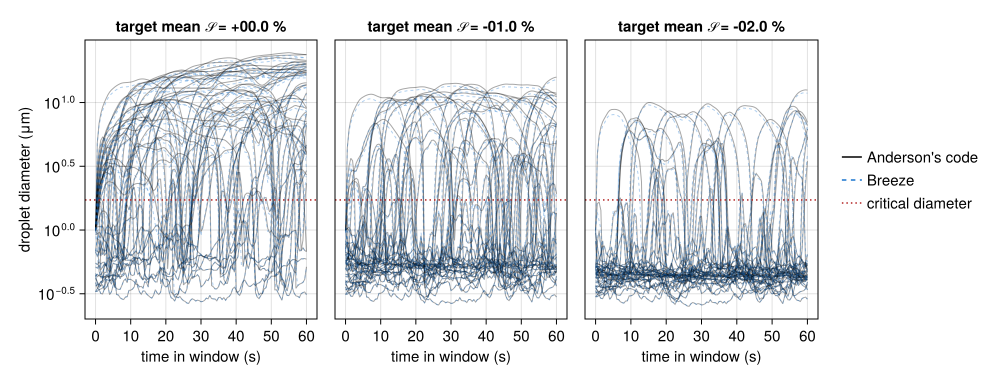
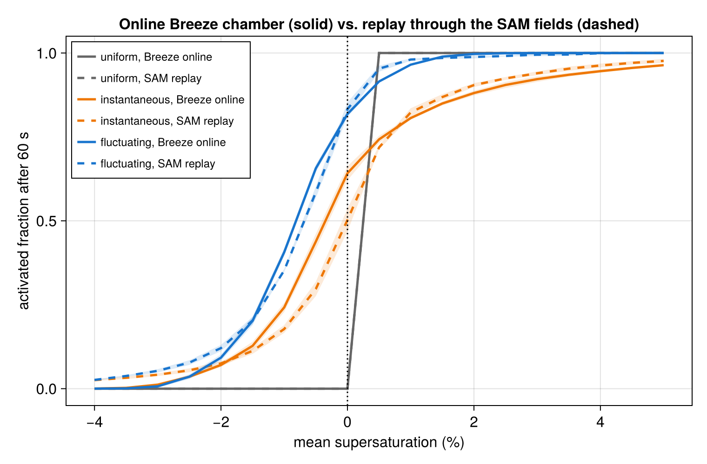

# TurbulentActivation.jl

Reproducing [Anderson et al. (2023)](https://doi.org/10.1029/2022GL102635) — droplet
activation enhanced by turbulent supersaturation fluctuations in the Michigan Tech Pi
Chamber — with *online* Lagrangian droplets in [Breeze.jl](https://github.com/NumericalEarth/Breeze.jl).

The infrastructure (six-wall bulk fluxes, κ-Köhler droplet physics, Lagrangian droplet
dynamics) lives in Breeze on the branch `glw/anderson-chamber`. This repository holds the
reproduction itself: the chamber configuration, the aerosol, the experiment drivers, the
reference audit, and the analysis.

## Layout

- `src/chamber.jl` — `PiChamber` configuration and `pi_chamber_model` (walls, dynamics, advection)
- `src/aerosol.jl` — Anderson's NaCl aerosol and droplet seeding at equilibrium
- `scripts/` — runnable drivers (`run_chamber.jl`, `run_droplets.jl`) and a Slurm helper
- `reference/audit.md` — paper vs. archive vs. live-code discrepancies (kept current)
- `analysis/` — post-processing

## Status

Field parity with the reference LES, with a physical wall model and the reference's own
condensation sink, and the droplet physics now checked directly against Anderson's code. No
reproduction claim against the paper's published figures yet.

The chamber (six-wall bulk fluxes, WENO(5) implicit LES with bounds-preserving WENO on the
moisture species, adaptive time step at CFL 0.7) convects, 10⁴ κ-Köhler droplets are advected
and grown online, and every droplet carries Anderson's counterfactual replicas for 19 target
mean supersaturations. The same droplet physics and replica construction are also replayed
offline through Anderson's SAM fields (`analysis/reference_trajectories.jl`), which is the
reference the online chamber is judged against.

### The droplet physics is Anderson's

`analysis/anderson_growth.py` runs his own code (`lfierce2/LagrangianDroplets`) on 200
supersaturation traces taken from the replay, and `analysis/growth_comparison.jl` steps the
same traces here. The activated fraction after 60 s agrees to one droplet in 200:

| target mean 𝒮 | Anderson's code | Breeze |
|---|---:|---:|
| 0 % | 0.840 | 0.840 |
| −1 % | 0.375 | 0.380 |
| −2 % | 0.135 | 0.135 |

The critical point agrees to 0.04 % (1.7219 vs 1.7212 μm). Individual diameters agree to
0.03–0.64 % in the median, with ours ≈ 4 % smaller at 60 s for the fastest growers, entirely
because pyrcel uses a temperature-independent latent heat of 2.25 × 10⁶ J kg⁻¹ where Breeze
uses the physical 2.47 × 10⁶ J kg⁻¹ at chamber temperature. Activation is a threshold
crossing, so the curve is insensitive to it.



### The chamber against the replay

Three quantities were calibrated from the reference fields themselves. The condensation rate in
the SAM snapshots gives a phase relaxation time of 72 s (`analysis/reference_condensation.jl`),
which the warm-only one-moment host reproduces with `relaxation_time = 28` (Breeze's rate carries
the latent-heat factor Γ ≈ 2.5). The wall model is a log law with the Monin–Obukhov stability
correction on the floor and ceiling and neutral side walls (`log_law_coefficient`), with a
1.4 mm roughness at the plates. And the side walls, which are the chamber's cold, dry sink, carry
a 3 mm roughness and a wetness of 0.90: their strength sets the temperature and their wetness sets
how much vapor leaves with the heat, and the two must move together, because at fixed vapor a 1 K
warm bias costs 7 % of relative humidity, more than the whole gap in the mean supersaturation.

At 64 × 64 × 32 with a 15 min spin-up and three 60 s windows:

| quantity | Breeze chamber | reference SAM fields |
|---|---:|---:|
| Lagrangian spread of 𝒮 along droplets | 1.95–2.04 % | 1.85–1.96 % |
| interior spread of 𝒮 | 1.24 % | 1.23 % |
| spread of 𝒮 over the box | 2.08 % | 1.94 % |
| correlation time τₛ | 2.9–3.0 s | 2.9–3.1 s |
| σ(T), σ(qᵛ) | 0.98 K, 0.81 g kg⁻¹ | 0.85 K, 0.72 g kg⁻¹ |
| mean 𝒮, interior | +0.65 % | +0.71 % |
| mean T, mean qᵛ | 288.17 K, 10.74 g kg⁻¹ | 287.62 K, 10.48 g kg⁻¹ |
| activated fraction after 60 s at −1 % (fluctuating) | 0.40–0.41 | 0.355 |
| at 0 % (fluctuating / instantaneous) | 0.82–0.83 / 0.63–0.67 | 0.85 / 0.51 |



What remains is a 0.55 K warm bias, a fluctuation amplitude 5–10 % high, and an enhancement at
−1 % that overshoots by about 0.05. Vertical refinement does not help: at a fixed wall
coefficient the warm bias barely moves and the chamber only gets quieter, because a thinner
near-wall cell holds a value closer to the wall's and the bulk flux shrinks with it. The wall
flux is the lever, not the grid (`figures/resolution_profiles.png`).

Animations of the fields and of the droplet population are made by `scripts/run_movie.jl` with
`analysis/make_movie.jl` and `analysis/make_particle_movie.jl`.

Open items: the residual warm bias; the correlation-time definition (Anderson reports 7.5 s where
the integral estimator gives 3 s in his own fields); the trajectory integration and supersaturation
definition against his code, the two parts of the replay still untested; second-order particle
advection; checkpointing.

## Installing

The package depends on Breeze's `glw/anderson-chamber` branch, declared in `[sources]`, so
`Pkg.instantiate()` fetches it. To develop against a local Breeze checkout instead:

```julia
using Pkg; Pkg.develop(path="/path/to/Breeze.jl")
```

## Running

```julia
julia --project=. scripts/run_windows.jl 64 64 32 25 3 10000 parity
```
spins the chamber up for 25 minutes and then runs three 60 s windows of Anderson's experiment
with 10⁴ droplets, writing `parity_activation.jld2` (activation curves, Lagrangian samples,
chamber statistics) and `parity_profiles.jld2` (horizontal-mean profiles). Environment
variables: `WALL_C` (wall transfer coefficient, default the `PiChamber` value), `DT` (time
step, 0.02 s), `HOST=bulk` with `HOST_TAU` (warm-only one-moment host microphysics with the
given relaxation time in seconds). `scripts/gpu.sbatch` wraps any script for Slurm.

Analysis: `analysis/activation_curve.jl` (curves and bands of one run),
`analysis/supersaturation_statistics.jl` (Lagrangian PDF, autocorrelation, correlation time),
`analysis/compare_curves.jl online.jld2 reference.jld2 out.png` (online against the replay),
`analysis/coefficient_sweep.jl reference.jld2 out.png C=file.jld2 ...`,
`analysis/reference_statistics.jl` (Eulerian statistics of the mirrored SAM fields), and
`analysis/reference_trajectories.jl N windows first_step out.jld2` (the replay of Anderson's
experiment through the SAM fields with Breeze's droplet physics).

Tests: `julia --project=. test/runtests.jl` (`Pkg.test()` currently fails inside Pkg with the
git-sourced Breeze dependency).
