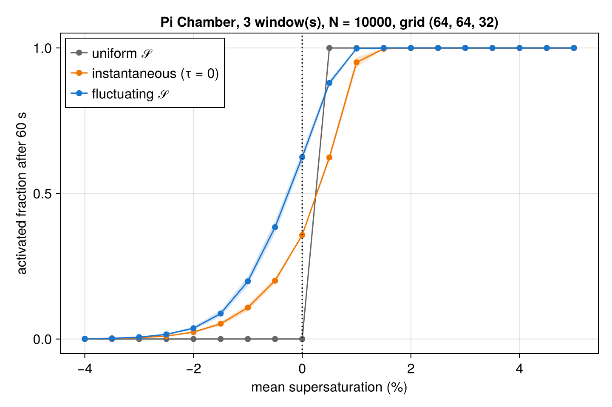

# TurbulentActivation.jl

Reproducing [Anderson et al. (2023)](https://doi.org/10.1029/2022GL102635) — droplet
activation enhanced by turbulent supersaturation fluctuations in the Michigan Tech Pi
Chamber — with *online* Lagrangian droplets in [Breeze.jl](https://github.com/NumericalEarth/Breeze.jl).

The infrastructure (six-wall bulk fluxes, κ-Köhler droplet physics, Lagrangian droplet
dynamics) lives in Breeze on the branch `glw/anderson-chamber`. This repository holds the
reproduction itself: the chamber configuration, the aerosol, the experiment drivers, the
reference audit, and the analysis.

## Layout

- `src/chamber.jl` — `PiChamber` configuration and `pi_chamber_model` (walls, dynamics, advection)
- `src/aerosol.jl` — Anderson's NaCl aerosol and droplet seeding at equilibrium
- `scripts/` — runnable drivers (`run_chamber.jl`, `run_droplets.jl`) and a Slurm helper
- `reference/audit.md` — paper vs. archive vs. live-code discrepancies (kept current)
- `analysis/` — post-processing

## Status

Infrastructure complete for the one-way experiment; no reproduction claim yet.

The chamber (six-wall bulk fluxes, WENO(9) implicit LES) convects, 10⁴ κ-Köhler droplets are
advected and grown online, and every droplet carries Anderson's counterfactual replicas for 19
target mean supersaturations. The first parity-resolution run (64 × 64 × 32, three 60 s
windows, chamber not yet stationary) reproduces the form of Anderson et al.'s Figure 2c:



Open items: a stationary chamber and its cloud-free mean supersaturation against the
reported +2.5 %; a condensation sink (the warm-only one-moment host is wired in; a
supersaturation-driven chamber scheme is planned in Breeze); the audited wall model in place
of the constant transfer coefficient; second-order particle advection; checkpointing; and the
comparison with the reference fields mirrored from the NERSC portal (see `reference/`).

## Installing

The package depends on Breeze's `glw/anderson-chamber` branch, declared in `[sources]`, so
`Pkg.instantiate()` fetches it. To develop against a local Breeze checkout instead:

```julia
using Pkg; Pkg.develop(path="/path/to/Breeze.jl")
```

## Running

```julia
julia --project=. scripts/run_droplets.jl 64 64 32 5 10000 parity
```
runs the parity-resolution chamber for five minutes with 10⁴ droplets.
