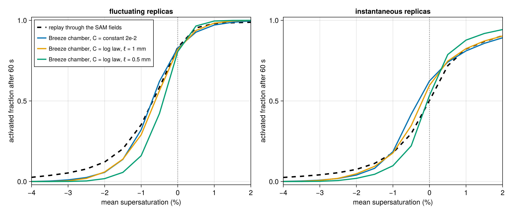

# TurbulentActivation.jl

Reproducing [Anderson et al. (2023)](https://doi.org/10.1029/2022GL102635) — droplet
activation enhanced by turbulent supersaturation fluctuations in the Michigan Tech Pi
Chamber — with *online* Lagrangian droplets in [Breeze.jl](https://github.com/NumericalEarth/Breeze.jl).

The infrastructure (six-wall bulk fluxes, κ-Köhler droplet physics, Lagrangian droplet
dynamics) lives in Breeze on the branch `glw/anderson-chamber`. This repository holds the
reproduction itself: the chamber configuration, the aerosol, the experiment drivers, the
reference audit, and the analysis.

## Layout

- `src/chamber.jl` — `PiChamber` configuration and `pi_chamber_model` (walls, dynamics, advection)
- `src/aerosol.jl` — Anderson's NaCl aerosol and droplet seeding at equilibrium
- `scripts/` — runnable drivers (`run_chamber.jl`, `run_droplets.jl`) and a Slurm helper
- `reference/audit.md` — paper vs. archive vs. live-code discrepancies (kept current)
- `analysis/` — post-processing

## Status

Field parity with the reference LES reached for the one-way experiment, with a physical wall
model and the reference's own condensation sink; no reproduction claim against the paper's
numbers yet.

The chamber (six-wall bulk fluxes, WENO(9) implicit LES) convects, 10⁴ κ-Köhler droplets are
advected and grown online, and every droplet carries Anderson's counterfactual replicas for 19
target mean supersaturations. The same droplet physics and the same replica construction are
also replayed offline through Anderson's SAM fields (`analysis/reference_trajectories.jl`),
which is the reference the online chamber is judged against.

Two quantities were calibrated from the reference fields themselves. The condensation rate in
the SAM snapshots correlates at 0.96 with the local supersaturation excess and gives a phase
relaxation time of 72 s (`analysis/reference_condensation.jl`), which the chamber's warm-only
one-moment host reproduces with `relaxation_time = 28` (Breeze's rate carries the latent-heat
factor Γ ≈ 2.5). The wall model is a log law with the Monin–Obukhov stability correction on the
floor and ceiling and neutral side walls (`log_law_coefficient`), and a 1 mm roughness length
gives, at 64 × 64 × 32 with a 15 min spin-up and three 60 s windows:

| quantity | Breeze chamber | reference SAM fields |
|---|---:|---:|
| interior spread of 𝒮 | 1.23 % | 1.23 % |
| spread of 𝒮 over the box | 1.82 % | 1.94 % |
| σ(T), σ(qᵛ) | 0.87 K, 0.69 g kg⁻¹ | 0.85 K, 0.72 g kg⁻¹ |
| mean 𝒮, interior | +0.48 % | +0.71 % |
| mean T | 288.9 K | 287.6 K |
| activated fraction after 60 s at a −1 % target (fluctuating) | 0.27–0.33 | 0.355 |
| at 0 % (fluctuating / instantaneous) | 0.80–0.83 / 0.59–0.60 | 0.85 / 0.51 |



The residual is a 1.3 K warm bias of the mean temperature. A constant coefficient of 2 × 10⁻²
reproduces the fluctuations equally well but leaves the mean supersaturation near zero, and
the neutral log-law value 6 × 10⁻³ gives fluctuations three times too weak. The 128 × 128 × 64
chamber reproduces the 64 × 64 × 32 statistics at the same settings (`figures/ladder_activation.png`).

Open items: the warm bias (the flux partition between floor, ceiling, and side walls); the
far tail of the activation curve (0.06 against 0.11 at −2 %); a numerical instability of the
cloudy chamber at Δt = 0.04 s (the dry chamber is stable there; production uses 0.02 s); the
correlation-time definition (Anderson reports 7.5 s where the integral estimator gives 3 s in
his own fields); second-order particle advection; checkpointing.

## Installing

The package depends on Breeze's `glw/anderson-chamber` branch, declared in `[sources]`, so
`Pkg.instantiate()` fetches it. To develop against a local Breeze checkout instead:

```julia
using Pkg; Pkg.develop(path="/path/to/Breeze.jl")
```

## Running

```julia
julia --project=. scripts/run_windows.jl 64 64 32 25 3 10000 parity
```
spins the chamber up for 25 minutes and then runs three 60 s windows of Anderson's experiment
with 10⁴ droplets, writing `parity_activation.jld2` (activation curves, Lagrangian samples,
chamber statistics) and `parity_profiles.jld2` (horizontal-mean profiles). Environment
variables: `WALL_C` (wall transfer coefficient, default the `PiChamber` value), `DT` (time
step, 0.02 s), `HOST=bulk` with `HOST_TAU` (warm-only one-moment host microphysics with the
given relaxation time in seconds). `scripts/gpu.sbatch` wraps any script for Slurm.

Analysis: `analysis/activation_curve.jl` (curves and bands of one run),
`analysis/supersaturation_statistics.jl` (Lagrangian PDF, autocorrelation, correlation time),
`analysis/compare_curves.jl online.jld2 reference.jld2 out.png` (online against the replay),
`analysis/coefficient_sweep.jl reference.jld2 out.png C=file.jld2 ...`,
`analysis/reference_statistics.jl` (Eulerian statistics of the mirrored SAM fields), and
`analysis/reference_trajectories.jl N windows first_step out.jld2` (the replay of Anderson's
experiment through the SAM fields with Breeze's droplet physics).

Tests: `julia --project=. test/runtests.jl` (`Pkg.test()` currently fails inside Pkg with the
git-sourced Breeze dependency).
