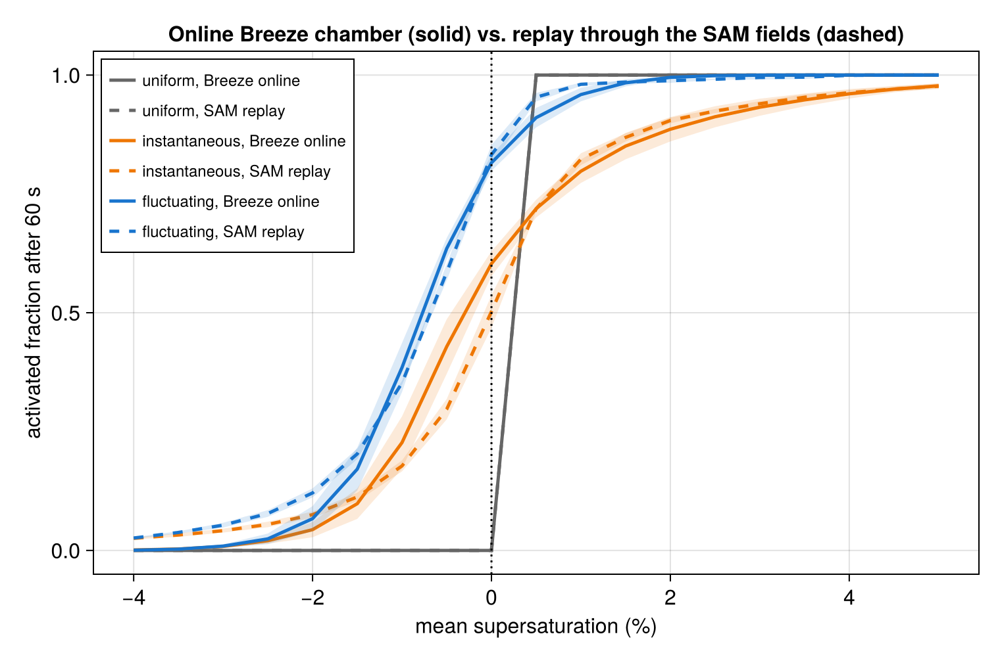

# TurbulentActivation.jl

Reproducing [Anderson et al. (2023)](https://doi.org/10.1029/2022GL102635) — droplet
activation enhanced by turbulent supersaturation fluctuations in the Michigan Tech Pi
Chamber — with *online* Lagrangian droplets in [Breeze.jl](https://github.com/NumericalEarth/Breeze.jl).

The infrastructure (six-wall bulk fluxes, κ-Köhler droplet physics, Lagrangian droplet
dynamics) lives in Breeze on the branch `glw/anderson-chamber`. This repository holds the
reproduction itself: the chamber configuration, the aerosol, the experiment drivers, the
reference audit, and the analysis.

## Layout

- `src/chamber.jl` — `PiChamber` configuration and `pi_chamber_model` (walls, dynamics, advection)
- `src/aerosol.jl` — Anderson's NaCl aerosol and droplet seeding at equilibrium
- `scripts/` — runnable drivers (`run_chamber.jl`, `run_droplets.jl`) and a Slurm helper
- `reference/audit.md` — paper vs. archive vs. live-code discrepancies (kept current)
- `analysis/` — post-processing

## Status

Field parity with the reference LES reached for the one-way experiment; no reproduction
claim against the paper's numbers yet.

The chamber (six-wall bulk fluxes, WENO(9) implicit LES) convects, 10⁴ κ-Köhler droplets are
advected and grown online, and every droplet carries Anderson's counterfactual replicas for 19
target mean supersaturations. The same droplet physics and the same replica construction are
also replayed offline through Anderson's SAM fields (`analysis/reference_trajectories.jl`),
which is the reference the online chamber is judged against. With the wall transfer
coefficient at 2 × 10⁻² (64 × 64 × 32, 25 min spin-up, three 60 s windows) the online
curves match the replay to within window scatter:



Online chamber: mean supersaturation +1.4 %, Lagrangian spread 1.6–1.8 %, correlation time
3.7–3.9 s. Replay through the reference fields: +0.63 %, 1.85–1.96 %, 2.9–3.1 s. Activated
fraction after 60 s (fluctuating / uniform / instantaneous) at a target mean of −1 %:
0.33–0.42 / 0 / 0.16–0.27 online against 0.355 / 0 / 0.165 in the replay; at 0 %:
0.80–0.83 / 0 / 0.59–0.63 against 0.85 / 0 / 0.51.

The wall transfer coefficient is the lever: with the neutral log-law value 6 × 10⁻³ the
chamber is too dry and too quiet (mean −1.1 %, spread 0.6 %) and the enhancement at −1 % is
0.06. The reference near-wall cells (bottom 1.2 K above the interior, top 1.1 K below,
against 0.3 K and 0.2 K in the weak-flux chamber) showed that the SAM wall fluxes are 4–5×
stronger, consistent with Yang et al. (2022): Monin–Obukhov fluxes on all six walls whose
magnitude depends on the grid spacing (see `reference/audit.md`).

Open items: the cloud-free mean supersaturation (+1.4 % against the reported +2.5 %; a
4 × 10⁻² run brackets it); the cloudy chamber at the calibrated coefficient (the warm-only
one-moment host is wired in; a supersaturation-driven chamber scheme is planned in Breeze);
the correlation-time definition (Anderson reports 7.5 s); second-order particle advection;
checkpointing; and the resolution ladder.

## Installing

The package depends on Breeze's `glw/anderson-chamber` branch, declared in `[sources]`, so
`Pkg.instantiate()` fetches it. To develop against a local Breeze checkout instead:

```julia
using Pkg; Pkg.develop(path="/path/to/Breeze.jl")
```

## Running

```julia
julia --project=. scripts/run_droplets.jl 64 64 32 5 10000 parity
```
runs the parity-resolution chamber for five minutes with 10⁴ droplets.
